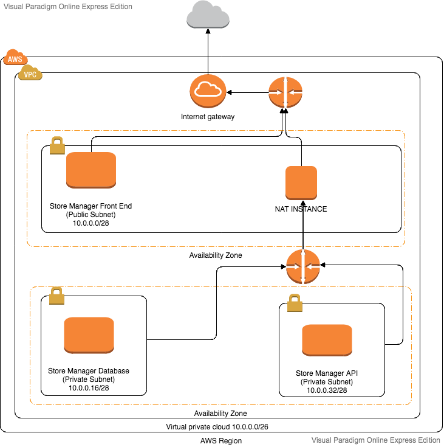

### AUTO DEPLOYMENT WITH TERRAFORM, VPC, ANSIBLE & PACKER
The aim of this project is to auto deploy a three-tier application comprised of the Front end, Backend(API server) and Database

### Technologies used
- [Packer](https://www.packer.io/) - This technology is used to make a packer AMI image on AWS
- [Ansible](www.ansible.com) - Ansible shall be used to provision the created packer AMI image
- [Terraform](https://www.terraform.io/)- Terraform shall help to plan, create and formulate an execution plan for the application
- [VPC](https://aws.amazon.com/vpc/) - Amazon VPC is used to set up security for the application
- [AWS](https://aws.amazon.com/)- AWS shall provide the platform to run the application

### Set up your environment
- First and foremost, this project requires you to register an account with [Amazon Web Services](https://aws.amazon.com/).
- Navigate to the [AWS website](https://aws.amazon.com/) and select `Create your AWS account`
- Follow through the registration process by supplying your email address, password and account name.
- Supply your address details in the next step and finally add valid credit card credentials to enable billing
- Once the registration process is successfully, you are ready to get started deploying your application

### How the application works
- Clone this repository by running `git clone https://github.com/mariamiah/FULL-STACK-DEPLOYMENT-WITH-TERRAFORM.git`
- Navigate into the cloned repository on the terminal by typing `cd FULL-STACK-DEPLOYMENT-WITH-TERRAFORM`
- Make a .pub file by running `ssh-keygen -y -f path-to-your-.pem-file > myAwsKey.pub` in your terminal
- Create a terraform.tfvars in your project and add all the necessary variables ass seen in an example `terraform.tfvars.sample`
- Run the script by typing `./launch.sh`
- Type `yes` at the terraform plan prompt in order to apply all the planned changes
- On completion of the script, check your AWS dashboard to ensure the VPC along with the corresponding subnets and instances have been created

### How to confirm successful deployment
#### The VPC
- Navigate to your AWS console
- Select `Services` in the menu bar
- Select `VPC`
- Navigate to the VPC dashboard
- Select `Your VPCs`
- A list of available VPCs shall be displayed including the newly created one tagged `storeManagerVPC`
#### Subnets
- Below the `Your VPCs` element, select `Subnets` on the right side menu of the VPC dashboard
- A list of four created subnets should be displayed in the table having the correct CIDR blocks, correct availability zones and having their state set to available

#### Route tables
- Below the `Subnets` menu, select `Route tables`
- You should be able to view two created route tables and they should be explicitly associated with 2 subnets
and having the same VPC ID as shown in the table

#### Internet Gateway
- Navigate to the `Internet gateway` option just below the `Route tables` option
- You should be able to view a created internet gateway with it's state set to `attached`
#### Elastic IP
- Navigate to the `Elastic IP` option and you should be able to view an elastic IP that has been associated to your nat-instance
#### The EC2 instances
- Finally, navigate to the EC2 service by selecting `Services` in the menu bar then `EC2`
- Select  `Instances` option from the left hand vertical menu
- A list of available instances is displayed along with their current status
- You should be able to view the four created instances having an Instance state set to `running`

### Cleaning up resources after successful build
Once the deployment is successful, you can clean up the resources by following these steps:
- Navigate to the cloned repo folder
- Run `chmod +x destroy.sh`
- Then type `./destroy.sh` in the terminal
This will remove all the resources that have been created with terraform

### The Network VPC Diagram for the store manager application


### Why CIDR?
- CIDR stands for Classless Inter-Domain Routing which is a set of Internet protocol (IP)standards that used to create unique addresses which identify devices on a network. With the introduction of CIDR, IP addressing became difficult therefore the need to introduce CIDR notation.
Adding the suffix /xx after the IP address shows that the address has been CLASSLESSly subnetted and that CIDR notation has been used.

- With CIDR notation, a network administrator is able to easily know the available subnets and hosts for a given network compared to the initial calculations that involved using the subnet mask.

- Another reason for using CIDR is because it is simpler to define with limited room for mistakes. This helps faster communication and efficiency.

- An example below illustrates the definition of an IP address and Subnet both without CIDR and then with CIDR to illustrate the simplicity brought about by CIDR

```Without CIDR
IP Address:..1.
Subnet:...0

With CIDR:
..1./
```

- Using CIDR notation also saves a lot of time and is prone to fewer errors.

### Subnetting using CIDR
An example of the IP address below with a CIDR notation of /20 shall be used to describe how to subnet using CIDR notation

`192.168.60.55/20`
##### What /20 means
- This represents the bit(prefix) length of the subnet mask. In other words, it is the number of consecutive ones in the subnet mask, the rest being zero's
For example
``` 11111111.11111111.11110000.00000000 ```

##### Step One ( Finding the subnet mask )
- In order to apply simplicity while subnetting, a simple table like one shown below can be referenced

|     |      |      |       |       |       |      |    |
| --- | ---- | -----| ----- | ----- | ----- |----- |----|
| 128 | 64   | 32   |  16   | 8     | 4     | 2    |1   |

Basing on the interpretation from the table above:
`11111111.11111111.11110000.0000000`
becomes
`255.255.240.0` as the native subnet mask

This is because the `11110000` subnet portion is `128 + 64 + 32 + 16 = 240` 

Note: The first four digits in the third octet are added because we want to derive a value for the four 1's.

##### Step two( Calculating the available networks)
```
- Subtract the network bits from 32.

/20 = 32-20
- Raise 2 to the power of the answer from above

2<sup>32-20</sup>

= 2<sup>12

The answer is 4096 available network Ids 
```

### Classes of IP addresses and their importance.
There are 5 classes of IP addresses according to the TCP/IP suite namely A, B, C, D, E

Each of these classes has a valid number of IP address ranges that serve different purposes.

##### Class A
- Class A addresses fall in the range of `0-127` for the first octet value
- The first 8 bits represent the network part while the rest of the 24 bits represent the host part as shown `N.H.H.H`
- Examples of class A address is 10.50.120.7 because the first decimal digit lies in the range of 0 and 127
- Class A addresses are designed for use by large companies like Google

##### Class B
- Class B addresses fall in the range of `128-191` for the first octet value
- The first two digits represent the network part while the last two digits represent the host part as shown `N.N.H.H`
- An example of a class B address is `172.16.55.13`
- Class B addresses are for use by medium-sized companies

##### Class C
- Class C addresses fall in the range of `192-223` for the first octet value
- The first three digits represent the network part while the last three represent the host part as shown `N.N.N.H`
- An example of the class address is `192.168.10.10`
- Class C addresses are designed for use by small enterprises

##### Special IP address ranges
- 0.0.0.0/8 – addresses used to communicate with the current network
- 127.0.0.0/8 – loopback addresses
- 169.254.0.0/16 – link-local addresses (APIPA)

### IPV6
The length of an IPV6 is 128 bits compared with the 32 bits in IPV4. Therefore the total number of potential addresses is 2<sup>128
- This makes IPV6 able to support way more nodes compared to IPV4
- This address is comprised of 128 bits divided into eight 16-bits blocks
- Each block is converted into a 4-digit hexadecimal number separated by colon symbols as shown `2001:0000:3238:DFE1:0063:0000:0000: FEFB`

### DNS record types and their uses
##### A-Records(Host Address)
- This is the most fundamental and commonly used record type
- It translates human-friendly domain names such as "www.google.com" into IP addresses which are machine friendly numbers such as `10.0.0.5`
- Records are needed for any computer that provides shared resources on a network and is equivalent to the host's file

##### AAAA Records(IPv6 Host addresses)
- This specifies the IPv6 of a host
##### ALIAS-Record (Auto Resolved ALIAS)
-Used for solving the classic problem with CNAME-records at the domain apex
- These are virtual alias records resolved by Simple DNS Plus at the time of each request
##### CNAME Records
- These are domain name aliases
-For example, the computer "computer1.xyz.com" may be both a web-server and an FTP-server, so two CNAME-records are defined:

`www.xyz.com` = `computer1.xyz.com` and `ftp.xyz.com` = `computer1.xyz.com`.
##### MX-Records(Mail Exchange)
- These specify the mail servers that are responsible for a domain name
- Each MX-record points to the name of the email-server and holds a reference number for that server.
